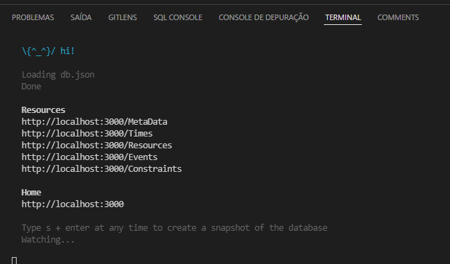
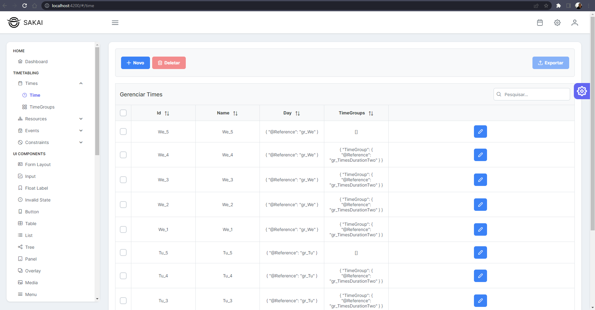

# Web-XHSTT

Aplicação web para manipulação de dados originalmente XHSTT convertidos para JSON.

A API é apenas uma base de dados no formato JSON que utiza o json-server para prover acesso e manipulação.

A interface gráfica utiliza o template Angular, Sakai do PrimeNG.

## Como rodar

### API

Dentro do diretório Web-XHSTT, na raiz da pasta, primeiro certifique-se de instalar o json-server com o comando:

    npm install json-server

Em seguida rode a API fake, necessário porta 3000 estar disponível:

    json-server --watch db.json

### Interface gráfica

Dentro do diretório Web-XHSTT, na pasta sakai-ng, primeiro certifique-se de instalar os pacotes npm do projeto com o comando:

    npm install

Em seguida rode o projeto com o comando, necessário porta 4200 estar disponível:

    npm start

## Como foram preparados os dados

Utilizando-se um conversor online de XML para JSON foi possível converter a instância `BR-SA-00` do XHSTT para um JSON válido.
