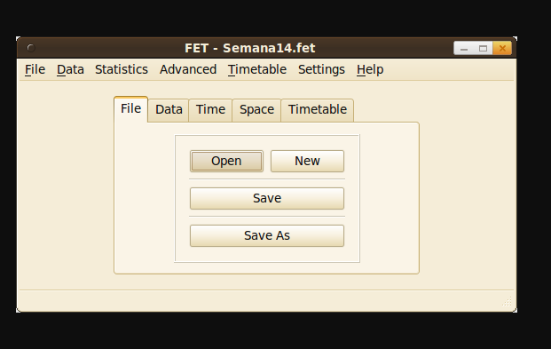
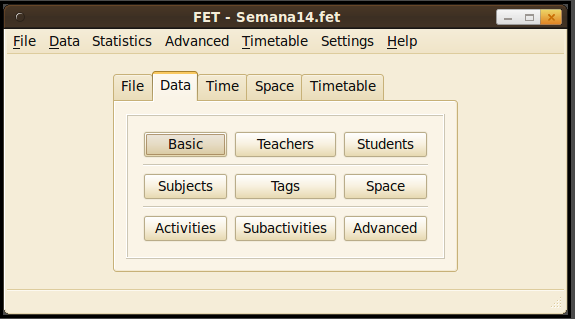
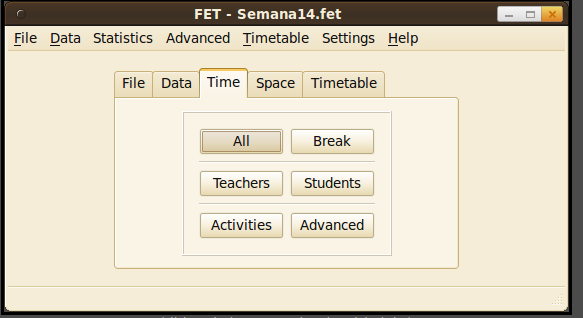
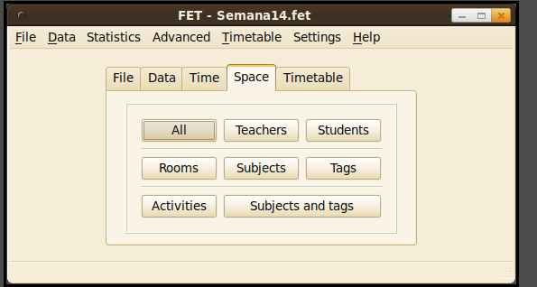
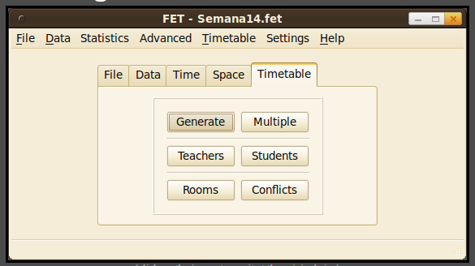
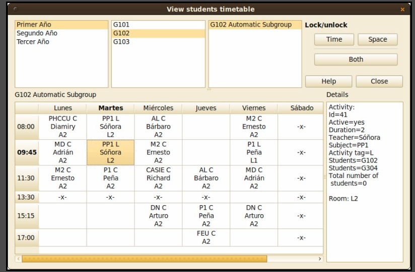

# FET

Aplicação Desktop, aparentemente desenvolvido em C++. Manual de ajuda no [link](https://lalescu.ro/liviu/fet/doc/en/Learn-FET-with-a-sample-file.pdf)

## Home - File

## Home - Data

## Home - Time

## Home - Space

## Home - Timetabling

## Planejamento de atividades

## Visão do horário - alunos

