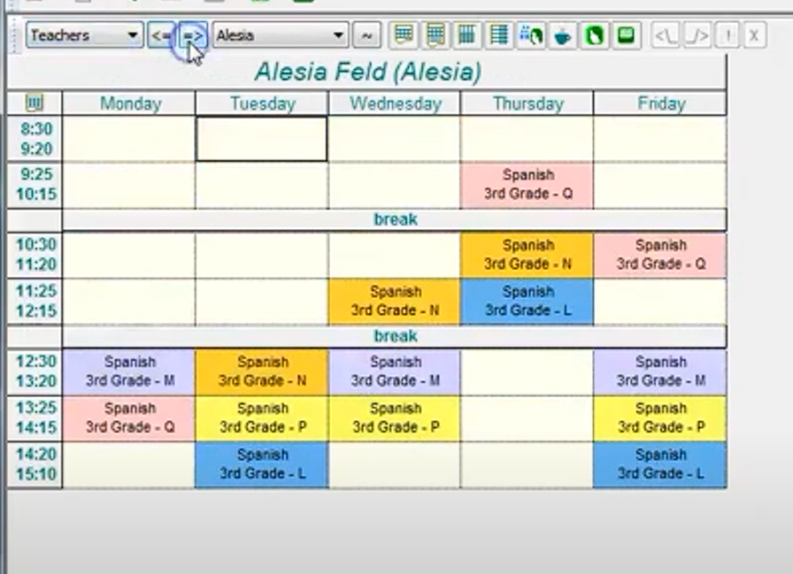

# GFC - Penalera Software

Aplicação Desktop, aparentemente desenvolvida em Java. Playlist de 22 vídeos tutorias no [link](https://www.penalara.com/pt/ES/videotutoriales/).

## Precificação

## Tela de cadastro de professores

## Tela de cadastro de professores - configuração inline

## Tela de configurações avançadas

## Configurações de pesos de opções

## Imagem da grade - visão dos estudantes

## Imagem da grade - visão dos professores

