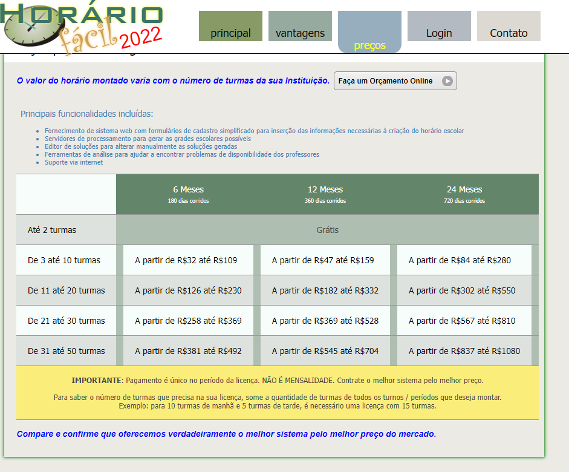
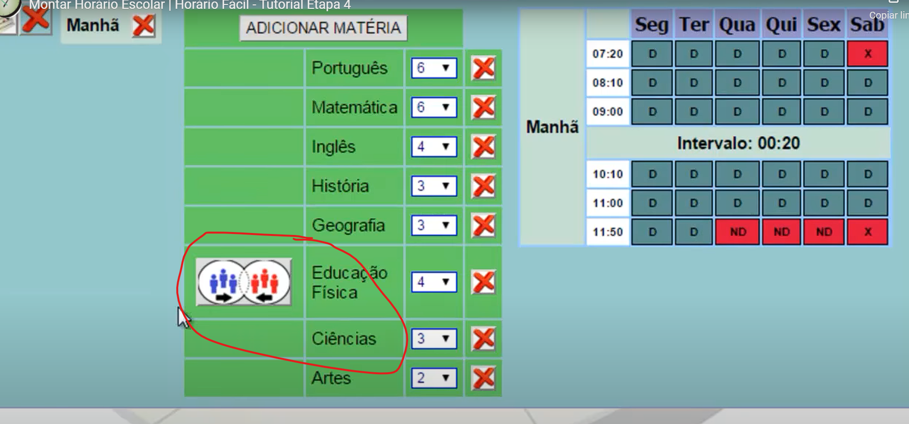

# Hora Facil

## Vídeos

* [Introdução](http://www.horariofacil.com/main/ajuda/introducao)
* [1-Informações Básicas](http://www.horariofacil.com/main/ajuda/etapa1)
* [2-Criando Horário de Funcionamento](http://www.horariofacil.com/main/ajuda/etapa2)
* [3-Adicionando Matérias/Disciplinas](http://www.horariofacil.com/main/ajuda/etapa3)
* [4-Salas e Grade de Horários](http://www.horariofacil.com/main/ajuda/etapa4)
* [5-Professores](http://www.horariofacil.com/main/ajuda/etapa5)
* [6-Aulas Geminadas](http://www.horariofacil.com/main/ajuda/etapa6)
* [Editor de soluções](http://www.horariofacil.com/main/ajuda/editorsolucao)
* [Problemas de visualização](http://www.horariofacil.com/main/ajuda/problemas-de-visualizacao)

## Screenshots

### Preço

### Cadastrando currículo da turma

### Restrições de professores

### Grade curricular

### Unir Recursos

